5月17日（日）、横浜・山下公園で開催された **WTCS横浜2026 エイジグループ・スタンダードA** で **2時間53分49秒** ─ 念願のサブ3で完走することができました。

<iframe src="https://www.youtube.com/embed/vf9hck6h_fE?start=18062" title="WTCS横浜2026 ライブ中継" frameborder="0" allow="accelerometer; clipboard-write; encrypted-media; gyroscope; picture-in-picture" allowfullscreen></iframe>

*↑ 5:01:02 あたりからスタンダードAのスタートが映る。オレンジのトライスーツがじゃぱそん。*

これからトライアスロンを始める方、横浜大会への参加を検討している方の参考になればと思って、大会の概要から当日の体感、各種目のリアルな数字までまとめておきます。

---

## Part 1：大会情報

### WTCS横浜とは

横浜大会は2009年の横浜開港150周年記念事業から始まり、2026年で **16度目の開催**。エリート（プロ）レースの翌日に開催される「エイジグループナショナルチャンピオンシップ」には、16〜80歳まで約1,800名が参加します。

| カテゴリ | 参加人数 |
|---|---|
| スタンダード個人 | **1,250名** ← 今回ここで参加 |
| スタンダード（リレー） | 50組150名 |
| スプリント（個人） | 280名 |
| スプリント（リレー） | 20組60名 |
| スプリント パラトライアスロン | 60名 |

ちなみに駐日EU大使も完走されたとのことで、国際色も豊か。スイムスタート時にも､お隣には海外から来た方がいて､規模の大きさを感じました｡(なんとなく､スゴイ大会に出ている気分｡※申し込めば誰でも出られます)

### コースの概要

**スタンダード距離**：

- 🏊 **スイム 1.5km**：山下公園前の海域
- 🚴 **バイク 40km**：山下公園 → 山下・本牧ふ頭エリア（複数周回）
- 🏃 **ラン 10km**：山下公園 → 赤レンガ倉庫 → 象の鼻パーク（2周回）

都市型のフラット基調コースで、みなとみらいや赤レンガ倉庫などの観光名所を走り抜ける贅沢なロケーション。

**📍 公式コースマップ：[エイジグループ コースマップ（公式PDF）](https://yokohamatriathlon.jp/wts/wp-content/uploads/2026/05/%E3%80%90%E7%A2%BA%E8%AA%8D%E3%80%91%E3%82%B3%E3%83%BC%E3%82%B9%E3%83%9E%E3%83%83%E3%83%97_260420-1-002_2.pdf)** （スタンダード／スプリント／リレー）

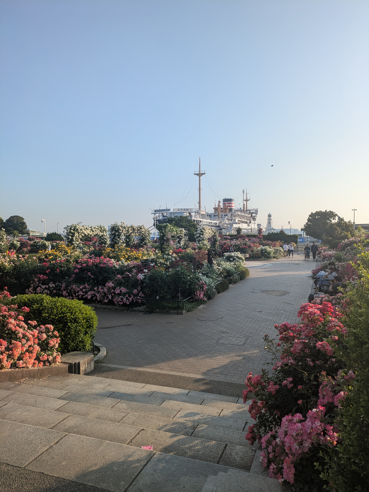

### この大会を選んだ理由

横浜市在住で近場なので**日帰りで行ける** こと。地方で行われるトライアスロンの大会は､前泊必須です｡
･･とはいえスタートが最も早い8時で､受付時間が6時〜6時20分なので始発で長津田を出発してギリ間に合う形でした｡
**スタンダードのAグループは最も早い 8:00スタート**。 

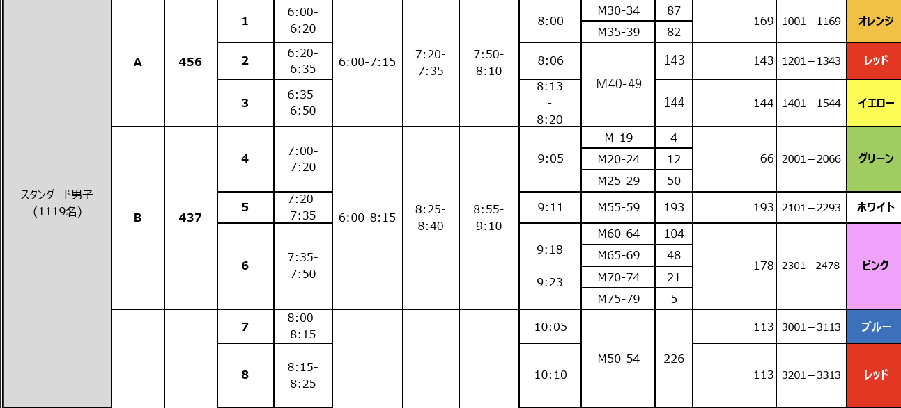

都内のスタート早い時間帯の方(30代､場所によっては40代も)は､結局前泊必須なので注意｡
そして何より **「横浜港、氷川丸の真横を泳げる」** ロケーション。あとで横浜に来るたびに「パパはここを泳いだんだよ」と息子に言える権利が手に入る大会です。

### 当日朝の流れ

**3:30 起床**。リストバンドをつけて､レースナンバーシールを腕に貼り､日焼け止めを塗って､朝食食べて･･･など､当日にしかできないことをサクサクと｡
レースナンバーシールは､アスリートガイドを見る限り､必須ではない模様｡でも､雰囲気出るからね､貼るよね｡

4:40台の電車で長津田 → 横浜線・東急東横線経由で5:40頃に元町中華街駅着。
元町中華街の駅のトイレにて朝のお通じを済ませる(重要)
輪行袋から自分のバイクを組み立てて､山下公園へ。

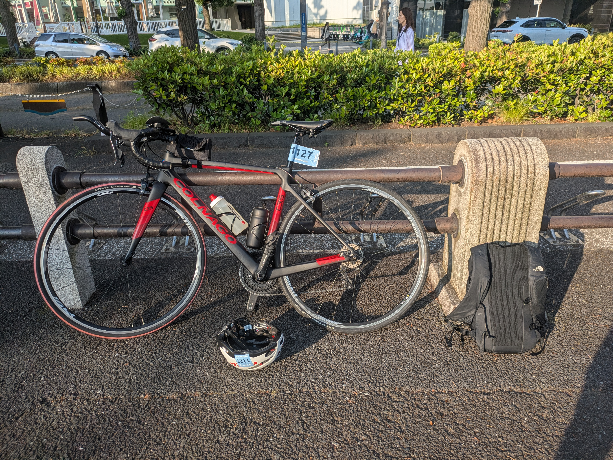

受付を済ませ､バイクチェックインへ。何度も出ているので5分もあれば完了してしまう。
(なので本当はもっと遅めに来たかったんだけど､受付が6時20分までだったのでやむなし)

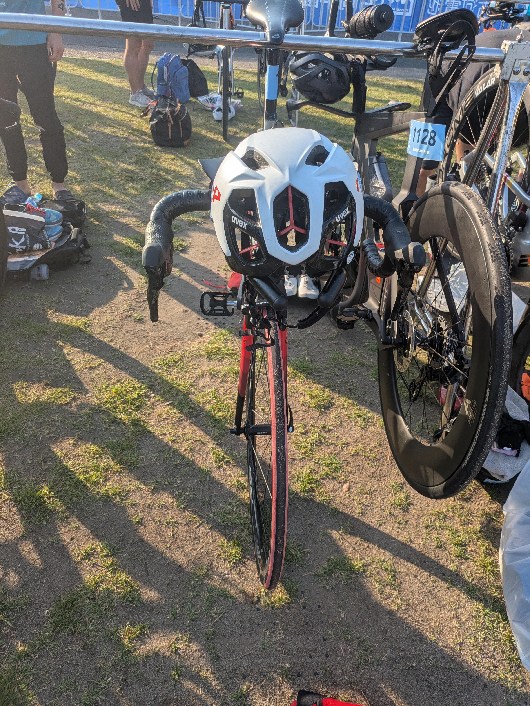

その後、スイムチェックインの8:20までかなり待ち時間が長い。ロードの試走もないし、ためし泳ぎもできない。ランシューもトランジションエリアに置いてしまったので､裸足のままストレッチと散歩、パラのスタートを見て持て余す感じ。

次回からは､バイクチェックインの時にトランジションエリアにランシュー以外をセット(&ウェットスーツとゴーグル･キャップも置いておく)して､ 手荷物を預け､ランシューでアップしながらスイムの時間を待つのがよさそう｡

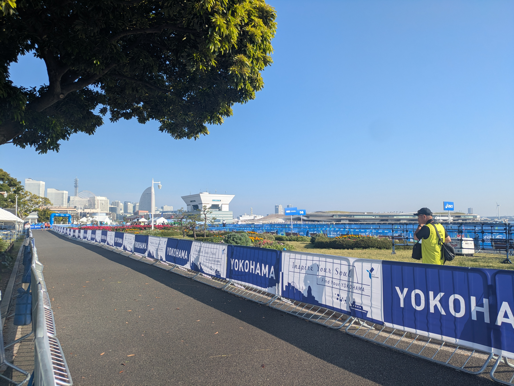

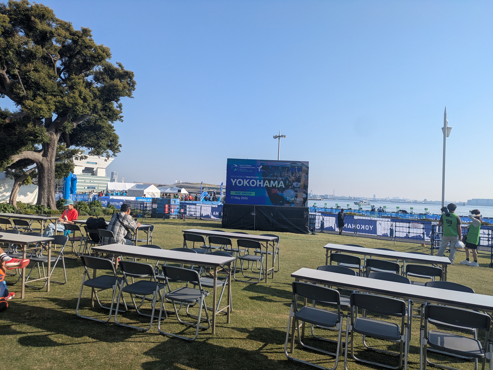

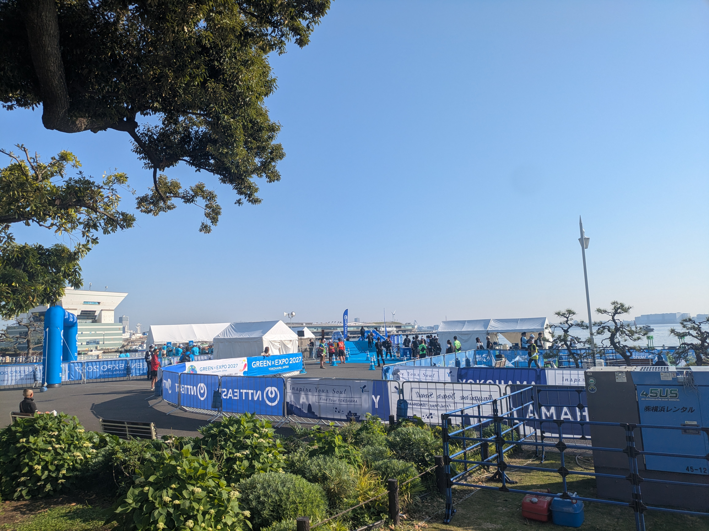

---

## Part 2：記録

### 結果サマリ

| 区間 | タイム | 累計 |
|---|---|---|
| 🏊 スイム（1.5km） | 33:29 | 33:29 |
| 🚴 バイク T1＋本体（40km） | 1:27:04 | 2:01:03 |
| バイク T2 | 2:06 | 2:03:09 |
| 🏃 ラン（10km） | 50:40 | 2:53:49 |
| **🏁 フィニッシュ** | | **2:53:49** |

**サブ3達成**。 過去のスタンダード距離ベストは **3:00:40（2023年 浜名湖トライアスロン）** だったので、 約7分の自己ベスト更新。各種目のラップ・心拍ゾーン・ペース分布は以下。

### 🏊 スイム編 ─ 氷川丸の横で

スイム本体：1.52km / 33:59 / 平均HR 148bpm。平均ペース2:16/100m。

心拍ゾーンは **Z3で64.6%・Z4で6.7%** の効率的なペーシング。Z5まで上げず温存できたのが、その後のバイクとランに効いてきます。

**一番印象的だったのは、2つめのブイから3つめのブイまでの道。** 左を見ると、氷川丸が「泳いでないとあり得ない角度」で並んで見える。普段は陸から見上げる客船を、海上から横並びで見るというのは、やってみないと味わえない景色でした。

ただし氷川丸沿いに泳ぐとブイから離れてしまうので、油断せずに･･

**GPSデータから振り返ると、軌跡距離1562m vs 公式距離1516mで蛇行率は1.030（約3%）。** ブイから離れないよう意識した結果、 ちゃんと直線で泳げていました。

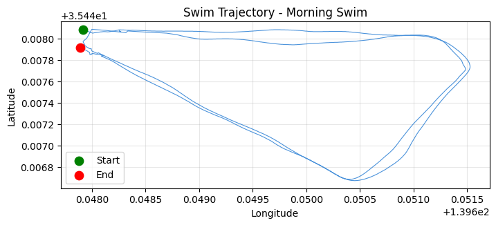

途中、平泳ぎの人が混じってきて「蹴られたくない!」とちょっとペースを上げて一気に抜かす場面も。**ゼッケンを上から付けたままウェットスーツを着てる人** が結構いたのも横浜ならではか？（作戦?初参加?）

※ゼッケンは通常 **バイクパートで初めて装着する** のがトライアスロン定石。スイム中につけてると、 ウェットスーツが脱ぎにくくなって T1で時間ロスするリスクがある。

**横浜の海、思ったよりは汚くなかった。においはしないし、水中で手元も見えた。普段大磯のオープンウォーターで練習してると視界ゼロが当たり前なので、まぁ許容範囲。(岸沿いの浮いている油とかごみとかは､あんまりみない方が良い)

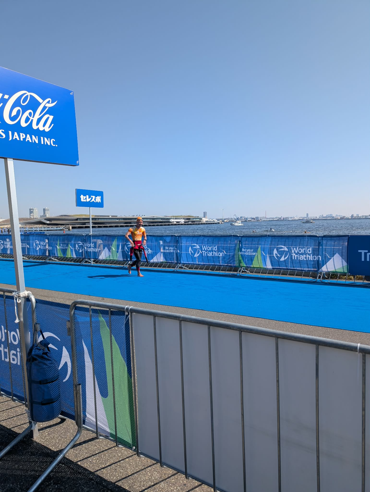

スイム上がり、ウェットスーツを脱ぎながら走る瞬間。

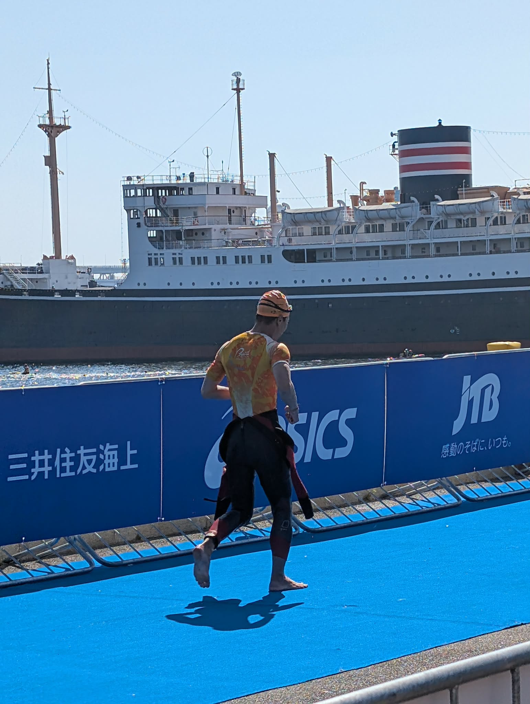

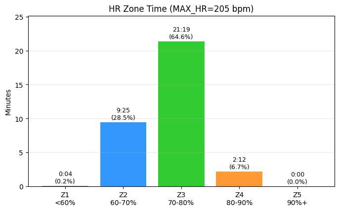

### 🚴 バイク編 ─ ストレート→カーブの繰り返し

バイク本体：39.80km / 1:20:46 / 平均HR 163bpm / 平均29.6km/h。

**Lap毎のタイム推移：**

| Lap | 距離 | タイム | 速度 | HR |
|---|---|---|---|---|
| 1 | 5km | 10:11 | 29.4 km/h | 160 |
| **2** | **5km** | **9:42** | **30.9 km/h** | 164 |
| 3 | 5km | 10:02 | 29.9 km/h | 164 |
| 4 | 5km | 10:05 | 29.7 km/h | 162 |
| 5 | 5km | 10:06 | 29.7 km/h | 161 |
| 6 | 5km | 10:24 | 28.8 km/h | 156 |
| 7 | 5km | 10:20 | 29.0 km/h | 158 |
| 8 | 4.8km | 9:54 | 29.1 km/h | 178 |

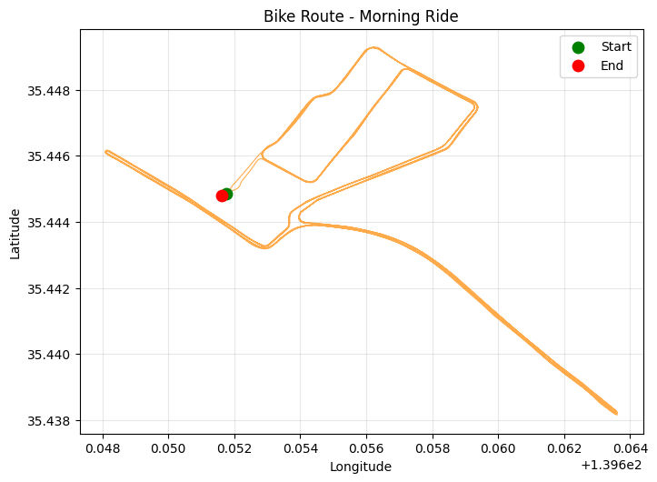

序盤を抑えてLap2-7でほぼイーブン、最終ラップで追い込みかける流れ。心拍ゾーンは **Z3 50.5% / Z4 43.1% / Z5 2.8%** で「持続可能だけど抑えすぎず」のラインを刻めました。

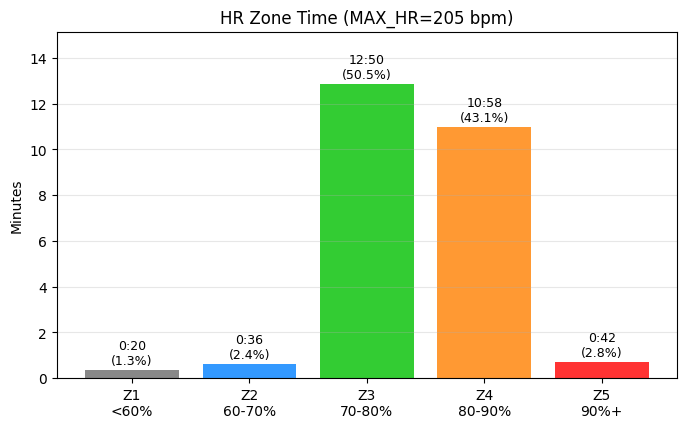

**コースは飽きない。** ストレート → カーブの繰り返しなので、走っていて単調にならない。大きな通りも通るので応援が届きやすいし、すぐに折り返すので応援を返しやすい（伝われ）。

参考までに、コース上を走る他選手の様子。スピード感と密度が伝わるはず。

<video controls width="100%" preload="metadata">
  <source src="../../assets/img/races/2026-05-17_yokohama_wts/bike_action.mp4" type="video/mp4">
</video>

**15km過ぎから右側の腰が痛い…** カーブ等での減速のタイミングを使って、サドルの上でお尻をぐりぐりマッサージしてどうにか耐える。ラスト1周になったらなぜか痛みが消えた。あとから振り返るに､舞浜まで60kmライドしたときなんかは腰痛はしなかったので､｣｢スピードを上げようとして踏み込みすぎている｣と分析｡踏み込みではなく､ケイデンスでスピード上げる練習をしよう､と決意｡

そして、 [DHバー（PROFILE DESIGN LEGACY II）](https://www.amazon.co.jp/dp/B0185OKVRY?tag=japason04-22)を始めてまともに使ったが完全にチートだった。何これ。風を切るように走れる。最高。

一方で、 説明通り6N締めたのに、 段差等で揺れたときにバーの角度がずれる…(恐怖)

**【後日談：対策購入】** 調べたところ、 カーボン製品のクランプ部はトルク管理だけだと滑ることがあって、 **専用の滑り止めペースト（カーボングリス）** を塗ると締結力が均等にかかってズレを防げるそう。さっそく Amazon で [FINISH LINE ファイバーグリップ 50g](https://www.amazon.co.jp/dp/B0012RIEM6?tag=japason04-22) をポチりました。次回ライドで効果検証予定。

**補給は液体糖質メイン**。 ボトルに **[粉飴（マルトデキストリン）](https://www.amazon.co.jp/dp/B0BVLGV3H2?tag=japason04-22)と蜂蜜** を溶かしたドリンクで持続的なカロリー補給、 別途 **[梅ぼし純](https://www.amazon.co.jp/dp/B0C2773V9X?tag=japason04-22)** で塩分・電解質補給。 **OD（オリンピックディスタンス＝スタンダードと同じ 51.5km）** ならジェルや固形補給食は持たず、 ボトル内糖質だけで十分という判断。

ボトルを飲むタイミングが意外と難しい。カーブ手前の減速のところがいいのか？

下のグラフを見ると、 速度の上下動と心拍の波が分かる。Lap毎のメリハリ＋最終ラップでのアタックも数字で確認できる。

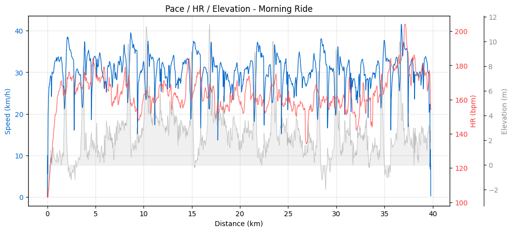

完全ソロのつもりだったけど、 **biwaチャレ同期の方と、 biwaチャレ時にコーチをしてくれていた山岸穂高さん（現 [3HAWK](https://www.tri3hawk.com/) 代表）と、 そのチームメンバーの方々からの応援に元気が出た**。

### 🏃 ラン編 ─ 「足が終わらない」優先で

ラン本体：9.36km / 50:47 / 平均HR 170bpm / 平均5:25/km。

**T2を出た時点で 2:03｡「6:00/kmを切るくらいのペースで走ればサブ3確定」**。 余力的にはまだ飛ばせる感じだったけど、 4月のフルマラソンで痛めた右ふくらはぎが膠着する感覚があり、 **「無理せず5:00/kmより速くは走らない」** という保守的なペース配分に。 とにかく「足が終わらないようにする」を最優先。

その結果として、 ペース帯分布はメインが 5-6分/km帯で 68.3% に集中：

| ペース帯 | 滞在時間 | 割合 |
|---|---|---|
| 4:00-5:00/km | 9:51 | 19.5% |
| **5:00-6:00/km** | **34:28** | **68.3%** |
| 6:00-7:00/km | 4:06 | 8.1% |
| 7:00-8:00/km | 0:54 | 1.8% |
| 8:00+/stop | 1:10 | 2.3% |

これは「右ふくらはぎを庇って小股に切り替えた」結果のペース配分。

**小股走法は意外と通用する。** 小股のままでも5分切ることは可能だと発覚。ただ、慣れていないので意識しないとペースが落ちてしまう。**「小股でスピードアップする練習」** は今後の宿題。

いつもバイクで1:40かかってるところを1:20で済んだのも大きい。そして **トライアスロン最早スタートグループ（8:00スタート）の宿命** か、いつもはランでごぼう抜きする側なのに、今回は **抜かれることの方が圧倒的に多い**。歩いている人もほとんど見かけない、早いグループの戦場でした。

体力的には余裕があったけど、右足の怪我が怖くて風景を楽しむ余裕はなかった。とにかくフォーム意識。

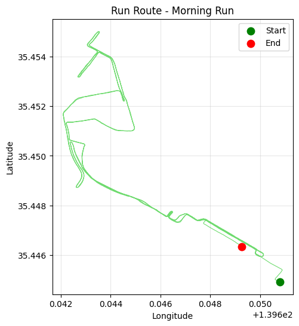

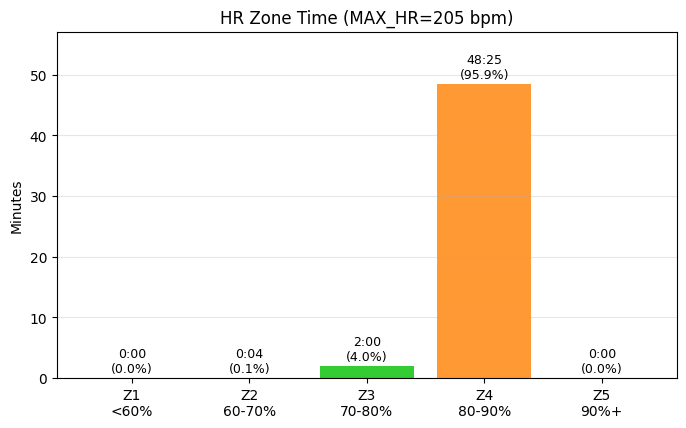

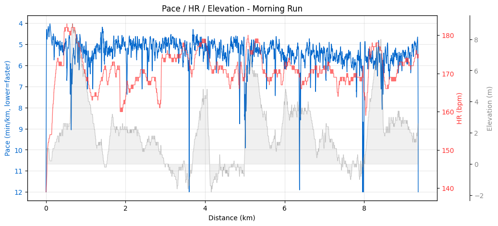

### 🏁 ゴール ─ 「あれ、こんなもんでいけるんだ」

**フィニッシュ瞬間の感情は「ケガなく無事ゴールで一安心」** 。サブ3達成への喜びより、まず怪我なく走り切れた安堵が先にきました。

そして「あれ、こんなもんでいけるんだ」という静かな手応え。

3年前の浜名湖トライアスロン（3:00:40）の時はランをめちゃくちゃ頑張ってこのタイムだった。今回はバイクが速くなった分の貯金がそのまま生きた形。**「バイクが速くなれば全体タイムが大きく変わる」** を改めて実感した1日でした。

### 同じ大会を走った仲間の声

仲間のツイートから：

<blockquote class="twitter-tweet" data-lang="ja">
横浜トライアスロンおつかれさまでした！暑い中のレースでしたが、みなさんにとって素晴らしいレースになったこと祈っています。
&mdash; 3HAWK 🐴 (@Triathlon_3HAWK) <a href="https://twitter.com/Triathlon_3HAWK/status/2055915785420493003">2026年5月17日</a></blockquote>

そう、**暑かった**。これは多くの選手が共通して言及していた点。ふくらはぎの心配が先行して暑さの記憶が薄かったけど、振り返ってみると確かに気温は高かったです。

<blockquote class="twitter-tweet" data-lang="en">
Great weather, great race! Very happy to complete <a href="https://twitter.com/worldtriathlon">@worldtriathlon</a> #Yokohama with my fellow triathletes.
&mdash; Jean-Eric Paquet 駐日EU大使 (@EUAmbJapan) <a href="https://twitter.com/EUAmbJapan/status/2055911651971617163">2026年5月17日</a></blockquote>

外交官も完走しているスケールの大会、という横浜の凄み。

---

## Part 3：その他

ゴールしたら、そのまま手荷物を渡してくれる導線のすばらしさに感動しつつ…

レース後は、バイクをピックアップしてすぐそばの駐輪ラックに停車（別にピックアップはあとでもよかったんだけど、気分的に）。徒歩10分ほどのところにある銭湯「恵びす温泉」へ。サウナは不要だったけど、水風呂入りたかったのでサウナ利用料+300円して870円。

このために財布を持ってきていたが、電子マネー利用可でした。

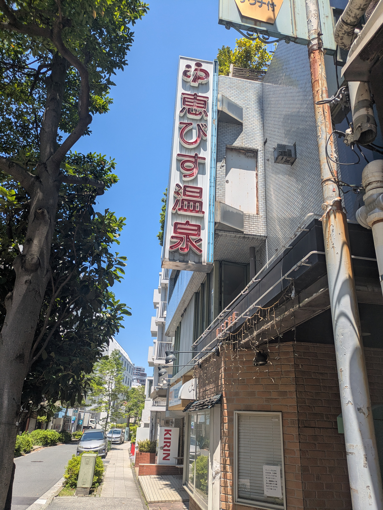

電気風呂・サウナ⇔水風呂を何往復かしたあと、戻って荷物を整理し、自走で次の予定（横浜でランチ）へ。
充実した1日でした。

### 右足ふくらはぎの痛みについて

4/19のかすみがうらマラソン35km地点でカチコチになり､その後様子を見るも直らない｡案の上横浜トライアスロン中にも気になって思いきって走れず｡

怖いのでレース翌日に整形外科に行って､ちゃんと検査してきました｡超音波エコーとレントゲンを撮るも異常なし｡｢筋疲労｣とのことなので､その足で鍼灸院に行って鍼治療をしてもらいました｡

感覚的には､ただの筋疲労じゃなさそうな雰囲気なんだけど･･

･夜のストレッチ
･走り方の改善

を進めていきます｡

## まとめ

- **WTCS横浜2026 エイジ・スタンダードA** で **2:53:49（サブ3達成、自己ベスト更新）**
- スイムは氷川丸の真横を泳ぐ唯一無二の体験
- 都市型レースは初参加の方にもアクセス良好でおすすめ

次は9月のロング距離レースに向けて、ふくらはぎ完治＋小股走法の精度向上＋バイクの腰痛対策を順次。

これからトライアスロンを始める方は、ぜひ一度都市型レースを体験してみてほしいです。
