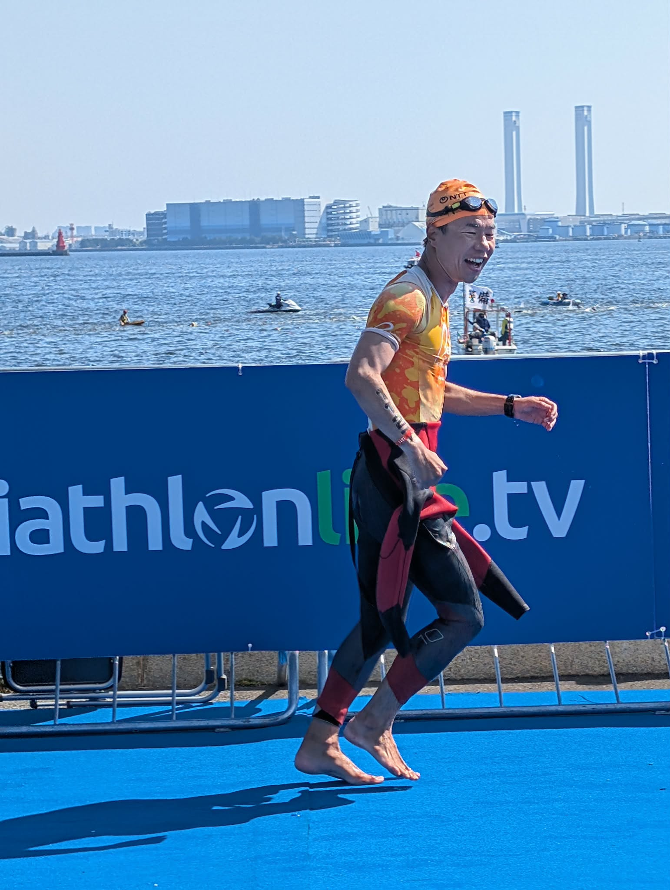
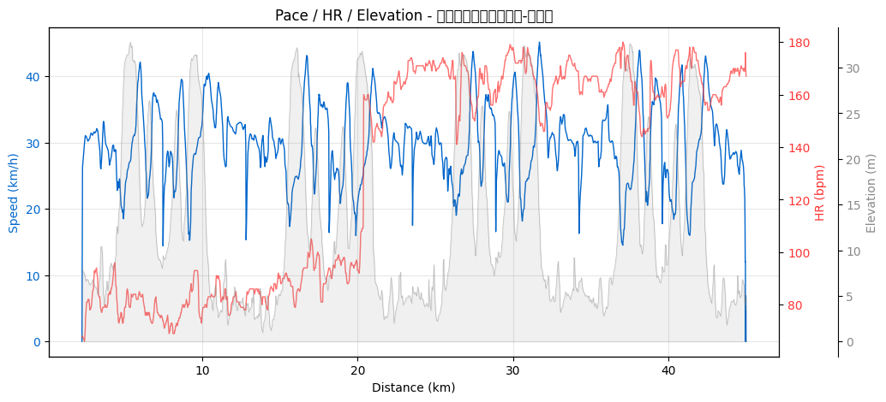

2023年5月のデビュー戦から数えて **3年・8レース**。途中で2024年のアキレス腱断裂を挟んでいます。

タイムでの自己ベスト更新（2026-05-17 横浜WTSで2:45:02）はうれしいんだけど、この記事で見たいのは **タイムじゃなくて中身の変化**。心拍はどうなったか、ペダルケイデンスは整ったか、心拍ゾーンの使い方は上手くなったか。

主に自分用の節目記録です。読んでくれる人はオマケ、ありがとう。

---

## Part 1：戦績の輪郭

| # | 日付 | レース | 種別 | 合計 |
|---|---|---|---|---|
| 1 | 2023-05-28 | 館山わかしお | OD | 2:57:32 |
| 2 | 2023-06-25 | レイクハマナ | OD | 2:53:54 |
| 3 | 2023-09-10 | Mt.富士 | OD | 3:03:15 |
| 4 | 2023-10-01 | LAKE BIWA | ミドル | 5:06:22 |
| 5 | 2023-10-08 | 九十九里 | ミドル | 5:55:14 |
| ─ | **2024年** | **アキレス腱断裂で全休** | | |
| 6 | 2025-08-03 | たかはらやま | 山岳OD | 3:15:19 |
| 7 | 2025-09-27 | 九十九里 | OD | 2:59:59 |
| 8 | 2026-05-17 | 横浜WTS | OD | **2:45:02** |

ここから先は「タイム」じゃなくて、**Stravaに残ってる心拍・ケイデンス・パワー・ゾーン分布で何が変わったか**を見ていきます。

> **データの注意点**：2023年9月（富士）〜2025年9月（九十九里OD）までの5レースは、Garminの心拍計測がうまく取れていません（センサー接触不良 or Multisportモードの設定影響）。なので心拍ベースの比較は3レース（**館山・浜名湖・横浜**）に限定されます。これは反省点。**次の大会から心拍は確実に取る**。

---

## Part 2：🚴 バイクで一番伸びたのは「ケイデンス」だった

タイムや速度より明確に上達が見えた指標が **ペダルケイデンス（rpm）**。

| 日付 | レース | バイクケイデンス | 前戦比 |
|---|---|---|---|
| 2023-05-28 | 館山 | **58.0 rpm** | デビュー戦 |
| 2023-06-25 | 浜名湖 | 74.8 rpm | **+16.8** |
| 2023-09-10 | 富士 | 78.6 rpm | +3.8 |
| 2023-10-01 | LAKE BIWA | **84.4 rpm** | +5.8 |
| 2023-10-08 | 九十九里M | 82.8 rpm | -1.6 |
| 2025-08-03 | たかはらやま | 71.3 rpm | （山岳でケイデンス低下） |

**デビュー戦の58rpmから半年で84rpmまで上昇**。これはペダリング理論で言うところの「重いギアをゆっくり踏む（=58rpm、脚に乳酸が溜まりやすい）」から「軽いギアを早く回す（=85〜90rpm目安、心肺主導）」への移行に相当します。

つまりこの半年で、バイクが **「脚力で押す」から「心肺で回す」に切り替わった**。

> **バイク経験者向け補足**：エアロロードに乗り換えたとかDHバー導入したわけじゃなく、純粋に **ペダリング技術** が変わった結果のはずです（ギア比は遠出系のミドルでも変わってる可能性あるが、デビュー戦と同じ機材＋同じバイクで2戦目から74.8rpmは技術しか説明できない）。

★加筆お願い：何を意識して変えた？ ローラー台での練習？ ペダリングの本？ それとも自然と？

ちなみに2025〜2026年はケイデンスセンサーが付いてないバイク構成だったか、Multisportモードのデータ拾い忘れで取れていません。ケイデンスは継続して測っておきたい指標。

### バイク心拍ゾーン分布の上達

3レースだけだけど、これも面白い。**「Z3以上で過ごせた時間の割合」がレース運びの上達度** と言える指標：

| レース | Z1 | Z2 | Z3 | Z4 | Z5 | **Z3+合計** |
|---|---|---|---|---|---|---|
| 館山 | 35.5% | 35.7% | 28.5% | 0.3% | 0% | **28.8%** |
| 浜名湖 | 41.8% | 0.9% | 21.9% | 35.3% | 0% | **57.2%** |
| 横浜 | 1.3% | 2.4% | 50.5% | 43.1% | 2.8% | **96.4%** |

**横浜では全体の96.4%をレース強度（Z3以上）に乗せられている**。これは要するに、コース全体を通じて **「踏める強度で踏み続けた」** ということ。

館山のZ1=35%、Z2=35%という分布は、「ペースが分からなくて入りで抑えすぎ」「集団に巻かれて出力出せず」「途中で脚を残しすぎ」など、初心者あるあるの分布。それが3年で完全に消えた。

### 心拍と速度の関係（同じ強度で何km/h出せるか）

「同じ心拍でどれだけ速いか」が心肺の効率指標。**km/h ÷ bpm × 1000** を見ると：

| レース | バイク速度 | 平均HR | 効率指標 (km/h/bpm × 1000) |
|---|---|---|---|
| 館山 | 27.5 km/h | 128 bpm | **214.8** |
| 浜名湖 | 28.4 km/h | 131 bpm | **216.8** |
| 横浜 | 29.6 km/h | 163 bpm | 181.6 |

**横浜は効率指数が下がってる**ように見えるけど、これは「心肺退化」じゃない。横浜は **心拍をあえて163bpmまで上げにいって速度を取りに行った** という解釈が正しい。レース戦略として **「踏める強度で踏みに行く勇気」**が育ったとも言える。

館山の128bpm平均は明らかに余裕。これは「初心者の安全運転」だったわけです。

---

## Part 3：🏃 ランは「ゾーンの使い方」が変わった ─ 特に横浜のZ5=0%

ランHRゾーンの変化。**ここに、復帰後の自分が一番出てる**。

| レース | Z1 | Z2 | Z3 | Z4 | Z5 |
|---|---|---|---|---|---|
| 館山 (2023-05-28) | 0.6% | 0.6% | 17.0% | 56.6% | **25.2%** |
| 浜名湖 (2023-06-25) | 0% | 0% | 3.6% | 82.6% | 13.8% |
| 横浜 (2026-05-17) | 0% | 0.1% | 4.0% | **95.9%** | **0%** |

**横浜のZ5=0%**、これがすべて。デビュー戦の館山では25.2%もZ5（最大心拍90%以上のスプリント領域）を使ってた。それが横浜では **意識的にZ5を一度も踏まないペーシング** で10km走り切っている。

これは2つ意味があると思っていて：

1. **腱を守る走り** ─ アキレス腱断裂を経験した後、無酸素ゾーンでの全力スプリントは腱への一発負荷が大きい。横浜での Z5=0% は **意識的な選択**
2. **ペーシング技術の成熟** ─ 入りから飛ばさず、Z4の上限近くで一定で押し切る走り方ができるようになった

ランパワーで見ても面白い：

| レース | 平均パワー | 加重平均 |
|---|---|---|
| 館山 | 258W | 263W |
| 浜名湖 | **272W** | 273W |
| 富士 | 261W | 264W |
| LAKE BIWA | 250W | 252W |
| 九十九里M | 257W | 258W |
| たかはらやま | 231W | 239W |
| 横浜 | 249W | 253W |

ピークは **浜名湖の272W**。横浜は249Wで、館山より低い。**つまり「より低いパワーで、より速いタイムを出している」** ─ ランニングエコノミー（同じ出力で出せる速度）が向上していると見ていい。

ペース分布も追跡しがいがある：

| レース | 4-5分台 | 5-6分台 |
|---|---|---|
| 館山 | 39.0% | 48.4% |
| 浜名湖 | **55.5%** | 40.1% |
| 横浜 | 19.5% | **68.3%** |

浜名湖はペース域が4分台中心。横浜は5分台中心。**「速い走り」から「安定した走り」へ** ─ これも腱保護の戦略の現れ。

★加筆お願い：横浜のZ5=0%、これは意識してたの？ それとも結果的に？

---

## Part 4：🏊 スイムは「ケイデンス上昇＋ピーク抑制」

スイムは3レースだけしかケイデンスデータが取れていないけど、興味深い：

| レース | 平均ケイデンス | 最大ケイデンス | 平均/最大の差 |
|---|---|---|---|
| 館山 (2023-05-28) | 26.0 spm | **112 spm** | 平均と最大が極端 |
| 横浜 (2026-05-17) | **31.9 spm** | 45 spm | 安定 |

館山の最大112 spm は明らかに「焦って手をバタつかせた瞬間」の数値。スイムケイデンスでこのレンジは異常で、初心者が人に蹴られそうになった時の反射的なストロークだと思われます。

それが横浜では平均31.9 spm（+5.9）まで増えて、**最大が45 spm まで下がっている**。これは：

- **平均が上がった** = ストローク頻度が上がった（推進力UP）
- **最大が下がった** = パニック的なバタつきが消えた（フォーム安定）

両方の方向で「整った」ということ。

スイムGPS蛇行率も見たけど：

| レース | 蛇行率 (GPS距離 ÷ 公式距離) |
|---|---|
| 館山 | 1.020 |
| 浜名湖 | 1.017 |
| 横浜 | 1.030 |

ほぼ変化なし＝ **OWSの直進性は最初からそれなりにできていた**。これは多分プールでスクエア（背中で泳ぐ際の直進感覚）を意識して泳いだ経験が効いてる、と勝手に推測。

★加筆お願い：スイムって何が一番変わった実感？

---

## Part 5：2024年、アキレス腱断裂

ここを書かないと数字の話が宙に浮く。

2024年（時期：★加筆お願い）、右アキレス腱を断裂しました。「ブチッ」という音と、その瞬間にランが止まる感覚。詳細は割愛しますが、**ラン中心スポーツであるトライアスロンにとって、一度人生計画を白紙にする出来事** でした。

### それでもトライアスロンを諦めなかった理由

★加筆お願い（家族の反応・諦めなかった理由・復帰モチベ）：

- 一番大きかった「諦めなかった理由」
- 妻／家族の反応（やめたら？と言われたか、背中を押されたか）
- 「もう走れないかも」と思った瞬間、そこから前を向いたきっかけ
- リハビリ中、何で気持ちを保ったか

### データから見える「賢くなった復帰」

数字が物語る復帰戦略があって、これは振り返ってみないと見えなかったこと：

1. **復帰初戦は山岳OD（たかはらやま）** ─ 「タイムが比較できないコース」を選んでる
2. **横浜のラン Z5=0%** ─ 全力スプリント領域を意識的に回避
3. **ランパワーは横浜249W** ─ 浜名湖272Wから23W絞り、その分ランニングエコノミーで稼ぐ走り

つまり **「無理しない」を選んだ結果、自己ベストが出た**。

「諦めなかった」だけでなく、**「諦めなかったけど無理もしなかった」**。これは復帰のひとつの教科書になり得る話だと思います。

---

## Part 6：横浜2026に見える「成熟」のサイン

ここまでの数字をまとめると、横浜のレースは技術的にこんな構造になっている：

| 観点 | 状態 |
|---|---|
| バイクケイデンス | （計測なし、要改善） |
| バイクHRゾーン | **Z3+ 96.4%＝レース強度に乗せ続けた** |
| バイク速度 | 29.6 km/h ＝全戦自己ベスト |
| ランHRゾーン | **Z5=0%＝腱保護のペーシング戦略** |
| ランパワー | 249W ＝浜名湖から23W低い |
| ランペース | 5-6分台中心の安定走 |
| スイムケイデンス | 平均上昇＋最大ピーク抑制＝フォーム成熟 |

**速度を上げに行ったのはバイクだけ**、ランは抑えに行って、結果として **「無理せず自己ベスト」** を成立させた。これがあんたの今の「成熟」の形だと思います。

---

## Part 7：次は IRONMAN 南北海道 2026-09-14

★加筆お願い：

- 申し込んだ理由（なぜ IRONMAN、なぜ南北海道）
- 申し込みタイミング（横浜の前？後？怪我中？）
- 一番不安なこと
- 一番楽しみなこと

ミドル2戦の経験と、横浜で見えた「無理しない強さ」の組み合わせは、ロング向きの資質に思える。あとはランの腱が180km走った後でも持ってくれるかどうか。

---

## まとめ ─ 3年で身体が学んだこと

1. **バイクは「踏む」から「回す」に変わった**（58rpm→84rpm）
2. **HRゾーンの使い方が整った**（Z3+ 28.8% → 96.4%）
3. **ランは「速さ」より「安定」を選べるようになった**（Z5回避＋パワー絞り）
4. **スイムは焦りが消えた**（最大ケイデンス112spm → 45spm）
5. **復帰戦は「比較できないコース」から入るのが正解だった**

タイムで見ると「自己ベスト更新」というシンプルな話だけど、中身は **「身体が学んだ3年の集大成」**。次のIRONMAN 南北海道に向けて、自分の現在地が見えました。

---

## 関連記事

- **[WTCS横浜2026 スタンダード完走記](2026-05-17-yokohama-wts-finish.html)** ← 直近レースの詳細
- [OWSに行く前のチェックリスト](2026-04-01-ows-checklist.html)

★加筆お願い：購入したリカバリー機材・シューズ・サプリのAmazonリンクを後日追記
